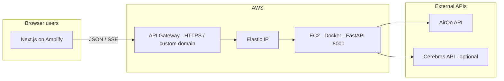

# Urban Better — Air Quality Backend

FastAPI service that powers the Urban Better air quality experience: it proxies and shapes **AirQo** device and measurement data, exposes a **map/filter configuration** API, and optionally uses **Cerebras** (OpenAI-compatible) for **LLM insight** and **multi-site compare** text.

The companion app is a **Next.js** frontend, hosted on **AWS Amplify**; this repository is the backend only.

---

## Table of contents

- [High-level architecture](#high-level-architecture)
- [Why these AWS services](#why-these-aws-services)
- [Backend design](#backend-design)
- [Prerequisites](#prerequisites)
- [Configuration](#configuration)
- [Run locally](#run-locally)
- [Run with Docker](#run-with-docker)
- [API overview](#api-overview)
- [Deployment (AWS) notes](#deployment-aws-notes)
- [CORS and the browser](#cors-and-the-browser)

---

## High-level architecture



- **End users** load the **Next.js** app from **AWS Amplify** (static hosting, HTTPS, preview branches, env-based API URL).
- The **API base URL** in the frontend should point to your **secure API endpoint** (not raw `http://<ec2-ip>:8000` from a production HTTPS page, because of browser mixed-content rules).
- **API Gateway** sits in front of the instance and provides a **stable HTTPS URL** (and optional custom domain, throttling, and auth). It forwards to the **Elastic IP** attached to **EC2**, where this service runs (typically in Docker on port **8000**).
- This service calls **AirQo** for device grids, site measurements, and history; it optionally calls **Cerebras** for generated insight and compare copy.

---

## Why these AWS services

| Service | Role |
|--------|------|
| **EC2** | Long-running Linux host for Docker and the FastAPI app; full control over runtime and `docker compose`. |
| **Elastic IP** | A fixed public IPv4 for the instance so its address does not change on stop/start; pairs well with a stable **API Gateway** integration (or Nginx) target. |
| **API Gateway** | Terminates **HTTPS** for a clean public URL, avoids exposing plain HTTP to browsers, and can route a path or stage to the backend **HTTP** integration (your EC2 listener). Complements Amplify, which only hosts the **frontend** — the backend stays on EC2. |
| **AWS Amplify** | Hosts the **Next.js** build, CDN, and environment-based `NEXT_PUBLIC_…` (or similar) API URL; separate from API Gateway by design. |

*Exact API Gateway resource types (HTTP API vs REST) and integration details depend on your console setup; the important part for developers is: **frontend** → public HTTPS **API** URL, **API Gateway** → **EC2** (Elastic IP) → **FastAPI**.*

---

## Backend design

- **Framework:** [FastAPI](https://fastapi.tiangolo.com/) + [Uvicorn](https://www.uvicorn.org/), async [httpx](https://www.python-httpx.org/) client (shared in app lifespan) for AirQo and LLM calls.
- **Config:** Pydantic Settings in `app/config/settings.py` with `.env` in the project root.
- **Layers:** Routers under `app/routers/`, data access and formatting under `app/repository/`, request/response models under `app/schema/`. Prompts for the LLM live in `app/utils/prompts.py`.
- **Entry point:** `main.py` at the repo root re-exports the ASGI `app` from `app/main.py` for `uvicorn main:app` and the Dockerfile.

**Directory layout (conceptual):**

```text
air_quality_bk/
├── main.py                 # Re-exports app for uvicorn / Docker
├── Dockerfile
├── docker-compose.yml
├── requirements.txt
├── .env                    # Not committed; copy from .env.example
├── app/
│   ├── main.py            # App factory, CORS, routes registration
│   ├── config/
│   ├── routers/           # health, filter, dashboard
│   ├── repository/        # AirQo, insight stream, site compare, grid filter, …
│   ├── schema/
│   └── utils/
```

---

## Prerequisites

- **Python 3.13+** (aligned with the Dockerfile) or a compatible 3.11+ environment if you run outside Docker.
- An **AirQo** API key (`AIRQO_API_KEY`) — see [Configuration](#configuration).
- Optional: **Cerebras** API key for LLM features.

---

## Configuration

Copy `.env.example` to `.env` and set values at the project root (same place `docker compose` and `pydantic-settings` expect the file).

| Variable | Required | Description |
|----------|----------|-------------|
| `AIRQO_API_KEY` | **Yes** | AirQo network token for devices/measurements. |
| `CEREBRAS_API_KEY` | No | Leave empty to disable Cerebras-backed insight/compare features that need the LLM. |
| `CEREBRAS_BASE_URL` | No | Default: `https://api.cerebras.ai/v1` |
| `CEREBRAS_MODEL` | No | Default: `llama3.1-8b` |
| `ALLOWED_ORIGINS` | No | JSON list, e.g. `["https://your-amplify.app","http://localhost:3000"]`. Default in code: `["*"]` (permissive). |

**Security note:** Tighten `ALLOWED_ORIGINS` in production if you are not using API Gateway with additional controls.

---

## Run locally

From the repository root:

```bash
python -m venv .venv
# Windows: .venv\Scripts\activate
# Linux / macOS: source .venv/bin/activate
pip install -r requirements.txt
```

Create `.env` with at least `AIRQO_API_KEY=...`.

**Development (auto-reload):**

```bash
uvicorn main:app --reload --host 0.0.0.0 --port 8000
```

- API root: [http://localhost:8000/](http://localhost:8000/) — “Welcome to Air quality backend”
- Interactive docs: [http://localhost:8000/docs](http://localhost:8000/docs)
- OpenAPI JSON: [http://localhost:8000/openapi.json](http://localhost:8000/openapi.json)

---

## Run with Docker

```bash
docker compose up -d --build
```

(If your host only has the older CLI, use `docker-compose` with a hyphen.)

- Service listens on **port 8000** on the host, mapped to the container: `http://localhost:8000/`.

Ensure `.env` exists next to `docker-compose.yml` so `AIRQO_API_KEY` is available inside the container.

---

## API overview

Routers are mounted at the **app root** (no `/api` prefix unless you add one behind API Gateway or Nginx). Typical routes:

| Method | Path | Purpose |
|--------|------|--------|
| `GET` | `/` | Welcome string |
| `GET` | `/health` | Liveness: `{"status":"ok"}` — use for load balancers and API Gateway health checks (configure path as needed) |
| `GET` | `/filter_config` | AirQo-based grid/region filter configuration for the UI |
| `GET` | `/dashboard-cards/{site_id}` | Aggregated / recent dashboard data for a site |
| `GET` | `/generate_insight` | **SSE** stream: query `site_id`, `start_date`, `end_date` (historical insight pipeline + optional Cerebras narrative) |
| `POST` | `/compare_sites` | LLM lines comparing 2–3 sites (Cerebras; body from `app/schema/compare_sites.py`) |

**Authoritative list:** `GET /docs` (Swagger UI) after the app starts.

---

## Deployment (AWS) notes

1. **EC2:** Amazon Linux 2 or Ubuntu, security group: SSH from your IP; for direct testing, HTTP to port **8000** (restrict in production in favor of API Gateway–only access).
2. **Elastic IP:** Associate with the instance so the API Gateway (or Nginx) integration target stays consistent.
3. **Push code** (git pull on the host or CI) and `docker compose up -d --build` in the app directory; keep `.env` on the server out of version control.
4. **API Gateway / custom domain** — point your **stable HTTPS** URL to this backend; in Amplify, set the frontend’s **public API base URL** to that HTTPS endpoint (e.g. `https://api.example.com` or the execute-api host).
5. **CORS:** If you restrict origins, include your **Amplify** app URL and local dev as needed. See [CORS and the browser](#cors-and-the-browser).

---

## CORS and the browser

- **CORS** is configured in `app/main.py` from `ALLOWED_ORIGINS`. With `*`, **credentials** are disabled in middleware (Starlette does not allow `Access-Control-Allow-Origin: *` with credentialed fetches).
- A **Next.js** app on **HTTPS (Amplify)** should call the backend over **HTTPS** (via API Gateway). An **HTTP** `http://<ip>:8000` URL from a page loaded over **HTTPS** is typically blocked as **mixed content**; use the secure API URL from the deployment section above.

---

## License and contribution

*Add your license and contribution guidelines as your project matures.*
